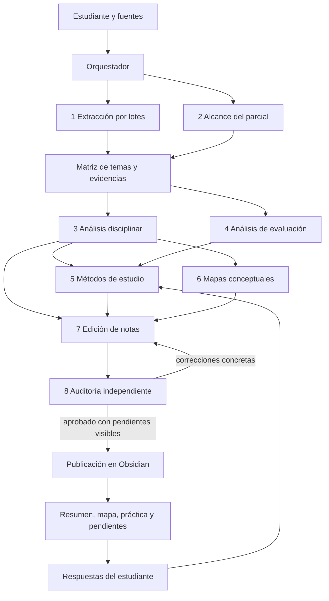

# Propuesta: agente de estudio para parciales

## Objetivo

Recibir la materia, el parcial, el programa, las indicaciones de la cátedra, bibliografía, apuntes y transcripciones; producir un resumen trazable y una práctica de estudio adaptada al examen. Conservar los resultados en Obsidian cuando el vault y su forma de escritura estén definidos.

El sistema debe poder contestar dos preguntas distintas: «¿está cubierto todo el temario conocido de este parcial?» y «¿puedo recuperar y aplicar ese contenido sin mirar el resumen?».

## Qué lo convierte en un sistema multiagente real

`SKILL.md` define un procedimiento reutilizable, pero por sí solo no crea subagentes. El orquestador necesita un entorno con delegación habilitada y debe asignar encargos concretos a subagentes con contexto separado, esperar sus resultados y resolver sus desacuerdos. En Codex se puede comenzar de forma interactiva con subagentes para una materia real. Si se desea ejecutar el flujo desde una aplicación propia, Agents API permite habilitar `agent.multi_agent.enabled` y limitar la concurrencia; la aplicación suministra el entorno de archivos y las herramientas necesarias.

El proyecto conserva instrucciones breves del orquestador en `AGENTS.md`, las skills en `.agents/skills/` y, cuando haga falta automatización fuera de Codex, código para iniciar sesiones y recoger resultados. Las descripciones de roles son contratos de trabajo del orquestador; no alcanza con crear carpetas llamadas «agentes».

Al principio usaría el mismo modelo disponible para coordinar y revisar, y mediría calidad, tiempo y costo con parciales reales antes de asignar modelos distintos por rol. La exactitud de las citas y la cobertura observable importan más que una lista fija de modelos.

## Agente principal: orquestador académico

Habla con el estudiante, identifica el examen y la versión vigente de las fuentes, decide qué trabajos pueden hacerse en paralelo y reúne los resultados. Mantiene un registro único de temas, evidencias, contradicciones y pendientes. Es el único que autoriza la versión final y coordina la escritura en el vault para evitar ediciones concurrentes de la misma nota.

Debe pedir solo los datos imprescindibles que falten: materia, instancia de examen, programa o indicación de alcance y ubicación del material. Fecha, modalidad, tiempo disponible y preferencias del estudiante mejoran la planificación, pero puede avanzar con un resumen provisional si todavía no se conocen.

## Ocho subagentes y contratos de salida

Son ocho responsabilidades independientes, además del orquestador. Pueden trabajar en paralelo cuando sus entradas están listas; no se crean ocho turnos simultáneos si el trabajo de unos depende de otros.

| N.º | Subagente | Encargo delimitado | Devuelve |
| --- | --- | --- | --- |
| 1 | **Extractor de fuentes** | Leer los archivos asignados, aplicar OCR o revisar transcripciones cuando haga falta y recuperar conceptos, ejemplos, ejercicios y anuncios. Se pueden iniciar varias instancias por lotes. | Fichas con fuente, página/minuto/sección, tema, contenido fiel y dudas de lectura. |
| 2 | **Arquitecto del temario** | Cruzar programa, cronograma, avisos y clases para delimitar la instancia concreta. | Matriz de subtemas con `confirmado/probable/incierto/excluido`, justificación y huecos de material. |
| 3 | **Analista disciplinar** | Reconstruir definiciones, relaciones, teorías, procedimientos, fórmulas, casos y contradicciones. | Esquema conceptual con dependencias, diferencias y profundidad necesaria. |
| 4 | **Analista de evaluación** | Estudiar modalidad, consignas, ejercicios y exámenes anteriores de esa cátedra para traducir el temario en capacidades evaluables. | Competencias por tema, tipos de preguntas plausibles y criterios de respuesta; sin probabilidades inventadas. |
| 5 | **Diseñador de métodos de estudio** | Seleccionar y aplicar métodos dentro de cada apunte y del plan general; después adaptar el trabajo a las respuestas del estudiante. | Actividades concretas, preguntas y claves separadas, sesiones de estudio, rúbricas y registro de errores. |
| 6 | **Cartógrafo conceptual** | Crear mapas con relaciones etiquetadas y elegir entre Mermaid, Canvas y notas índice según el objetivo. | Diagrama validable, `.canvas` cuando corresponda, enlaces a notas reales y actividad para reconstruir el mapa sin mirar. |
| 7 | **Editor de notas y Obsidian** | Escribir el resumen desarrollado y las actividades aprobadas; aplicar las skills de formato y, si existe, la política específica del vault para rutas, propiedades y enlaces. Es el único subagente que modifica notas finales. | Notas Markdown, índice del parcial, práctica, mapa y registro de pendientes. |
| 8 | **Auditor independiente** | Leer borradores y mapas contra las fuentes originales y la matriz; revisar también soluciones, enlaces y adecuación de actividades al temario. | Hallazgos `respaldado/parcial/sin respaldo/contradicción`, cobertura por tema y correcciones accionables. |

## Flujo de una ejecución

1. El orquestador crea un inventario. Extracción y análisis del alcance pueden comenzar en paralelo cuando usan fuentes diferentes.
2. Se construye la matriz de temas y evidencias. La recuperación semántica puede ayudar a encontrar pasajes, pero no reemplaza la lectura exhaustiva del programa y los avisos del examen.
3. El analista organiza el contenido. El analista de evaluación establece qué deberá poder hacer el estudiante en la modalidad conocida del examen. El diseñador de estudio y el cartógrafo trabajan sobre esas salidas.
4. El editor prepara notas y artefactos. El auditor relee las fuentes originales, la matriz, los mapas y las respuestas, devuelve correcciones concretas y señala material inaccesible o contradictorio. No se usan porcentajes de precisión estimados por el propio modelo.
5. Tras corregir los hallazgos, el editor publica en Obsidian. Si la skill o el acceso al vault todavía no existen, entrega Markdown y Canvas preparados para importar.
6. Cuando el estudiante responde preguntas o resuelve problemas, el diseñador de estudio registra aciertos, errores y dificultad observada para ajustar los siguientes repasos.

## Subagente de métodos de estudio

Su trabajo comprende **seleccionar, aplicar y evaluar** métodos, no solo recomendar nombres de técnicas.

- Antes de planificar, identifica modalidad del parcial, fecha, temas, tiempo disponible y tareas de aprendizaje: recordar definiciones, relacionar autores, explicar oralmente, resolver problemas, interpretar casos o escribir ensayos.
- Usa recuperación activa con respuesta oculta y retroalimentación. Distribuye repasos en los días disponibles. Intercala tipos de problemas cuando distinguirlos es parte de la habilidad; usa ejemplos resueltos y práctica independiente para procedimientos nuevos. Adapta las preguntas a la modalidad real del examen.
- Conoce Pomodoro como método de planificación, ejecución, pausas y registro. Propone metas observables por bloque; 25 minutos de trabajo y 5 de pausa son un punto de partida adaptable. Inserta en el apunte una tarea concreta de recuperación o aplicación para cada bloque útil y registra qué se logró. El temporizador no sustituye la práctica de recuperación.
- Cada pregunta o ejercicio lleva un tema de la matriz, una respuesta o rúbrica verificable y fuente. No genera tarjetas automáticas para cada frase del resumen.
- Después de una práctica, pide o lee respuestas del estudiante, distingue error conceptual, olvido, confusión entre temas y error de procedimiento, y asigna el siguiente repaso. Mide desempeño por tema a partir de respuestas observadas; no estima dominio a partir de una sensación de familiaridad.
- Sus entregables mínimos son: preguntas sin respuestas visibles, soluciones o criterios separados, plan de sesiones, registro de errores y lista de temas que requieren nueva explicación. Si falta la fecha del examen, propone una secuencia flexible en lugar de un calendario ficticio.

## Skills del proyecto

| Skill | Estado | Función |
| --- | --- | --- |
| `resumen-parciales` | Local | Alcance, síntesis, trazabilidad de fuentes y auditoría de cobertura. |
| `metodos-de-estudio` | Local | Recuperación activa, práctica distribuida, Pomodoro, preguntas, feedback y adaptación al desempeño. |
| `mapas-conceptuales-estudio` | Local | Elegir y diseñar mapas con relaciones verificadas y actividad para reconstruirlos. |
| `obsidian-markdown` | Instalada de `kepano/obsidian-skills` | Sintaxis de notas, wikilinks, propiedades, callouts y Mermaid. |
| `json-canvas` | Instalada de `kepano/obsidian-skills` | Crear y validar mapas `.canvas` con nodos y conexiones. |
| `obsidian-bases` | Instalada de `kepano/obsidian-skills` | Crear vistas `.base` de notas y seguimiento cuando aporten valor. |
| `find-skills` | Instalada de `vercel-labs/skills` | Buscar y evaluar nuevas skills al ampliar el sistema; no interviene en cada parcial. |
| `skill-creator` | Local | Crear y mantener skills propias; no interviene en cada parcial. |

Estas skills se instalaron **en el proyecto**, para que los agentes que trabajen desde esta carpeta tengan sus instrucciones. Las tres de Obsidian definen formatos; falta una política del vault concreto (ruta, estructura, nombres, plantillas y reglas de actualización). Cuando se conozca el vault, esa política puede convertirse en una skill local `escritura-vault-facultad`.

### Asignación por agente

| Agente | Skills y herramientas principales |
| --- | --- |
| Orquestador | `resumen-parciales`; delegación de subagentes, inventario de archivos y matriz de evidencias. `find-skills` y `skill-creator` solo para mantenimiento del sistema. |
| 1. Extractor | Lectores de PDF/documentos, OCR o transcripción si corresponde; entrega fragmentos localizables sin reescribir las fuentes. |
| 2. Arquitecto del temario | `resumen-parciales`; programa, anuncios, cronograma y búsqueda local para armar la matriz de alcance. |
| 3. Analista disciplinar | `resumen-parciales`; cotejo de bibliografía y clases, y web académica solo para aclaraciones identificadas como externas. |
| 4. Analista de evaluación | `resumen-parciales`; exámenes previos, consignas, rúbricas y modalidad documentada. |
| 5. Diseñador de métodos | `metodos-de-estudio`; matriz de temas, notas verificadas y respuestas del estudiante. |
| 6. Cartógrafo | `mapas-conceptuales-estudio`, `json-canvas` y `obsidian-markdown`; fuentes y notas existentes. |
| 7. Editor | `resumen-parciales`, `obsidian-markdown`, `json-canvas` y `obsidian-bases` si hay seguimiento; escritura local del vault cuando se conozca. |
| 8. Auditor | `resumen-parciales` y `metodos-de-estudio`; lectura independiente de fuentes y borradores, validación de referencias, enlaces, preguntas y soluciones. |

Las funciones de extracción y verificación son roles de subagente. Solo necesitan skills separadas si aparecen procedimientos repetibles que mejoren su ejecución, por ejemplo reglas para transcripciones con un formato propio de la facultad.

## Herramientas

| Herramienta | Uso | Estado inicial |
| --- | --- | --- |
| Lectura de archivos y búsqueda local | Programa, apuntes, transcripciones, Markdown y búsqueda de evidencias. | Disponible en el proyecto. |
| Lectura de PDF y documentos | Páginas, tablas y figuras; extracción visual cuando importe. | Skills de PDF y documentos disponibles en Codex. |
| OCR y transcripción de audio | Imágenes o clases sin texto legible. | Añadir solo si los insumos lo requieren; marcar calidad y revisar términos críticos. |
| Búsqueda web | Aclarar conceptos con fuentes académicas o primarias y documentar ampliaciones externas. | Disponible; nunca determina por sí misma el temario de la cátedra. |
| Obsidian | Escribir Markdown, Mermaid, JSON Canvas y, si conviene, Bases; leer y editar el vault siguiendo su política específica. | Skills de formato instaladas. Falta definir ruta/acceso y convenciones del vault; MCP es opcional para un vault local. |
| Rúbrica y registro de respuestas | Puntuar prácticas por tema y registrar errores observados. | Puede empezar con Markdown o JSON local, sin base de datos externa. |

La primera versión no requiere PostgreSQL, embeddings, vector DB ni un MCP de Obsidian. Se incorporan si el volumen de materiales o las consultas históricas muestran una necesidad concreta. Una búsqueda vectorial de fragmentos no basta para certificar cobertura total del programa.

## Implementación por etapas

1. **Ya preparado en el proyecto:** instrucciones del orquestador, skills de alcance, métodos de estudio, mapas y formatos de Obsidian.
2. **Primer parcial real:** inventariar las fuentes, ejecutar los ocho roles cuando tengan entradas disponibles, revisar la matriz de alcance y producir un paquete de notas con práctica y auditoría. El índice enlaza resumen por unidades, mapas, preguntas, soluciones separadas y pendientes de cobertura.
3. **Integración del vault:** identificar ruta y convenciones existentes, escribir una política específica de actualización y entonces publicar las notas finales, Canvas y vistas Bases útiles. Evitar notas atómicas automáticas que multipliquen duplicados.
4. **Adaptación posterior:** registrar respuestas reales, clasificar errores y programar repasos. Añadir OCR, transcripción o búsqueda semántica solo si los materiales muestran esa necesidad.

## Criterios de aceptación

- Todos los temas confirmados tienen desarrollo o quedan señalados como faltantes.
- Las afirmaciones centrales, preguntas y soluciones apuntan a fuentes verificables.
- Las discrepancias entre cátedra, transcripción y bibliografía quedan visibles.
- El plan de estudio cambia cuando el estudiante aporta respuestas o errores.
- Las notas de Obsidian respetan el vault existente y no sobrescriben anotaciones propias sin revisión.

## Bases consultadas

- [OpenAI: orquestación multiagente](https://developers.openai.com/api/docs/guides/agents-api/multi-agent).
- [OpenAI: configuración de agentes](https://developers.openai.com/api/docs/guides/agents-api/configuration).
- [Dunlosky et al., revisión de técnicas de estudio](https://www.psychologicalscience.org/journals/pspi/1529100612453266/).
- [Cirillo: método Pomodoro](https://www.pomodorotechnique.com/pomodoro-self-paced/).
- [Obsidian: Canvas](https://obsidian.md/help/plugins/canvas).
- [Obsidian: almacenamiento del vault](https://obsidian.md/help/data-storage).
